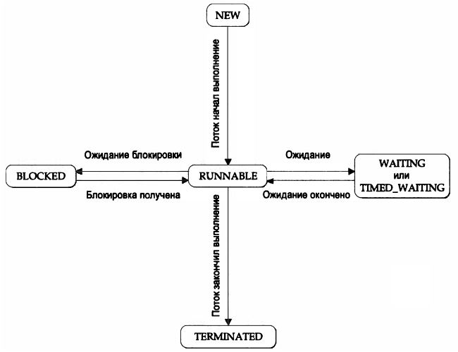

# Глава 11. Многопоточное программирование

В Java предоставляется встроенная на уровне языка поддержка многопоточного программирования.

Это многозадачность на основе **потоков** исполнения.
Потоки исполнения используют одно и то же адресное пространство в пределах одного процесса.

**Состояния потоков исполнения:**
* выполняется;
* готов к выполнению;
* приостановлен;
* возобновлён;
* заблокирован;
* прерван.

**Приоритет потока** определяет поведение данного потока по отношению к другим потокам.
Это целое число, которое используется при принятии решения о _переключении контекста_.
 
**Переключение контекста** - это переход от одного потока исполнения к другому (выделение ему времени процессора (ЦП)
  планировщиком потоков).

**Правила**, определяющие когда должно происходить переключение контекста:
* Поток добровольно уступает управление: тогда проверяются приоритеты всех потоков и ресурсы ЦП передаются потоку, 
  имеющему наибольший приоритет и готовому к выполнению.
* Поток вытеснен другим, более приоритетным потоком: низкоприоритетный поток просто вытесняется высокоприоритетным.
  Это так называемая  вытесняющая многозадачность (многозадачностъ с приоритетами).

## Класс Thread и интерфейс Runnable

Многопоточная система в Java построена на основе класса java.lang.Thread, его методах и дополняющем его интерфейсе 
java.lang.Runnable.

Когда программа запускается на выполнение, сразу начинает выполняться один поток - **главный поток исполнения**.
Он создаётся автоматически, но его объект можно получить и управлять им: `Thread t = Thread.currentThread();`
* От него порождаются все дочерние потоки исполнения;
* Он должен быть последним потоком, завершающим выполнение программы (если он завершается раньше дочерних потоков,
  то исполняющая система JRE может "зависнуть".

Конструкторы класса Thread:
```
Thread ();
Thread (String имя_потока);
Thread (Runnable объект_потока);
Thread (Runnable объект_потока, String имя_потока);
Thread (ThreadGroup группа_потоков, String имя_потока);
Thread (ThreadGroup группа_потоков, Runnable объект_потока);
Thread (ThreadGroup группа_потоков, Runnable объект_потока, String имя_потока);
Thread (ThreadGroup группа_потоков, Runnable объект_потока, String имя_потока, long размер_стека);
```

**Основные методы** управления потоком исполнения из класса Thread:

| Метод                    | Назначение                                                                                |
| ------------------------ | ----------------------------------------------------------------------------------------- |
| setName, getName         | Устанавливает/возвращает имя потока                                                       |
| setPriority, getPriority | Устанавливает/возвращает приоритет потока*                                                |
| setDaemon, isDaemon      | Устанавливает/определяет для потока режима демона** (установка только до запуска потока)  |
| getState                 | Возвращает состояние потока (не предназначен для синхронизации потоков)                   |
| interrupt                | Прерывает выполнение потока                                                               |
| isAlive                  | Определяет выполняется ли поток                                                           |
| isInterrupted            | Определяет прерван ли поток                                                               |
| join                     | Ожидает завершения потока                                                                 |
| run                      | Задаёт точку входа в поток (код внутри этого метода выполняется в потоке)                 |
| sleep                    | Приостанавливает выполнение потока на заданное время                                      |
| start                    | Запускает поток, вызывая его метод run                                                    |

*Приоритет потока изменяется от MIN_PRIORITY = 1 до MAX_PRIORITY = 10, значение по умолчанию - NORM_PRIORITY = 5.
 
**Поток-демон (служба/service) обычно запускается с наименьшим приоритетом и работает в фоновом режиме
(например, как сборщик мусора). Когда завершаются все пользовательские потоки (не потоки-демоны),
то поток-демон завершается автоматически. Он может быть завершён в любое время, JVM не заботится о его завершении из
рабочего состояния как для обычных потоков. Когда JVM останавливается, то все оставшиеся потоки-демоны "забрасываются"
(блоки finally не выполняются, стек не раскручивается (unwound)- JVM просто выгружается).

**Возможные состояния потока** (перечисление Thread.State):

| Значение      | Состояние                                                                                            |
| ------------- | ---------------------------------------------------------------------------------------------------- |
| BLOCKED       | Поток приостановил выполнение, поскольку ожидает получения блокировки                                |
| NEW           | Поток еще не начал выполнение                                                                        |
| RUNNABLE      | Поток выполняется или начнёт выполняться, когда получит доступ к ЦП                                  |
| TERMINATED    | Поток завершил выполнение                                                                            |
| TIMED_WAITING | Поток приостановил выполнение на определенный промежуток времени, например, после вызова методов sleep(), wait(), join() |
| WAITING       | Поток приостановил выполнение, ожидая некоторого действия, например, вызова версии метода wait() или join() без заданного времени ожидания |



## Создание потока

Два способа получить новый экземпляр объекта класса Thread:

* **Реализация интерфейса Runnable**

  Необходимо объявить класс, реализующий интерфейс Runnable и метод run() в нём.
  Код, помещённый в методе run(), будет выполняться в новом потоке исполнения. Этот поток исполнения завершится,
  когда метод run() возвратит управление. Запуск потока на исполнение осуществляется с помощью вызова метода start().

* **Расширение класса Thread**

  Необходимо объявить класс, расширяющий класс Thread, переопределить метод run() в нём,
  а затем создать экземпляр этого класса. Для запуска потока на исполнение также необходимо вызвать метод start().

Выбор способа: считается, что классы следует расширять только в том случае, если они должны быть усовершенствованы или
каким-то образом видоизменены. Если ни один из других методов (кроме run()) не переопределяется в классе Thread,
то лучше и проще реализовать интерфейс Runnable. При реализации интерфейса Runnable класс порождаемого потока 
не обязан наследовать класс Thread.

## Синхронизация

**Синхронизация** - это процесс, обеспечивающий одновременный доступ к совместно используемому ресурсу только одним потоком.

**Монитор** - это объект, используемый в качестве взаимоисключающей блокировки. Только один поток исполнения может в одно 
и то же время владеть монитором. Когда поток исполнения запрашивает блокировку, то говорят, что он входит в монитор.
Все другие потоки исполнения, пытающиеся войти в заблокированный монитор, будут приостановлены до тех пор, 
пока первый поток не выйдет из монитора. Обо всех прочих потоках говорят, что они ожидают монитор.
Поток, владеющий монитором, может, если пожелает, повторно войти в него.

Синхронизация в Java поддерживается на уровне языка, у объектов имеются свои, неявно связанные с ними мониторы.

Состояние гонок - это одновременный вызов в потоках исполнения одного и того же метода для того же самого объекта.

**Ключевое слово synchronized** (модификатор доступа) - используется для синхронизации выполнения кода двумя способами:

* **Применение синхронизированных методов** - объявление метода с модификатором доступа synchronized. Вызов такого
  метода приводит к входу в монитор объекта. Когда поток исполнения оказывается в теле синхронизированного метода,
  то все другие потоки или любые другие синхронизированные методы, пытающиеся вызвать его для того же самого экземпляра,
  вынуждены ожидать.
```
synchronized имя_метода() {
    // тело_метода
}
```

* **Оператор synchronized** - заключение вызовов методов в блок оператора synchronized.
  Блок оператора synchronized  гарантирует, что вызов метода, являющегося членом того же класса, что и синхронизируемый 
  объект, на который делается ссылка, произойдет только тогда, когда текущий поток исполнения успешно войдет в монитор 
  данного объекта.
```
synchronized (ссылка_на_синхронизируемый_объект) {
    // синхронизируемые операторы
}
```

## Взаимодействие потоков исполнения

Механизм взаимодействия потоков реализован с помощью методов wait(), notify() и notifyAll() класса Object.

Эти методы могут быть вызваны только из синхронизированного контекста.

* **wait()** - вынуждает вызывающий поток исполнения уступить монитор и перейти в состояние ожидания до тех пор,
  пока какой-нибудь другой поток исполнения не войдет в тот же монитор и не вызовет метод notify().
  В очень редких случаях возможно, что исполнение ожидающего потока возобновляется без вызова метода notify() или
  notifyAll(). Это - _ложная активизация_, для предотвращения которой рекомендуется вызывать метод wait() в цикле,
  проверяющем условие (булевую переменную), по которому поток ожидает возобновления.
  
* **notify()** - возобновляет исполнение потока, из которого был вызван метод wait() для того же самого объекта.

* **notifyAll()** - возобновляет исполнение всех потоков, из которых был вызван метод wait() для того же самого объекта.
  Одному из этих потоков предоставляется доступ.

**Взаимная блокировка**

Взаимная блокировка - ошибка, которая происходит в том случае, когда потоки исполнения имеют циклическую зависимость
от пары синхронизированных объектов.
* Возникает когда исполнение двух потоков точно совпадает по времени;
* Может возникнуть, когда в ней участвует и больше двух потоков исполнения и двух синхронизированных объектов.

**Приостановка, возобновление и остановка потоков исполнения**

До версии Java 2 использовались методы suspend (приостановка), resume (возобновление), stop (остановка) класса Thread.
Начиная с версии Java 2 эти методы не рекомендованы к использованию (deprecated).
Методы suspend, stop способны порождать серьёзные системные сбои, повреждая записываемые данные в момент остановки.

Для приостановки, возобновления или прерывания потока необходимо выполнять проверки в методе run() и оттуда 
управлять выполнением потока. Для этого используется флаговая переменная, обозначающая состояние потока исполнения.
До тех пор, пока эта флаговая переменная содержит признак "выполняется", метод  run() должен продолжать выполнение.
Если же эта переменная содержит признак "приостановить", поток исполнения должен быть приостановлен.
А если флаговая переменная получает признак "остановить", то поток исполнения должен завершиться.
Именно такой механизм должен применяться во всяком новом коде.
