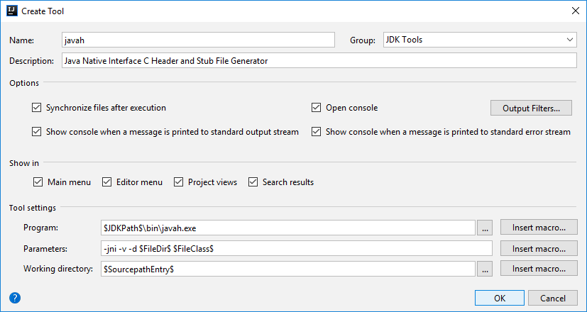

# Глава 13. Ввод-вывод и прочие вопросы

java.io, transient, volatile, instanceof, strictfp, native, assert, вызов перегружаемых конструкторов по ссылке this(), 
компактные профили прикладного программного интерфейса Java API

## Потоки ввода-вывода

**Поток ввода-вывода** - это абстракция, которая поставляет или потребляет информацию.
Поток ввода-вывода связан с физическим устройством через систему ввода-вывода.
_Независимо от физического устройства_ и соответствующего ему типа ввода (из файла на диске, клавиатуры или сетевого 
соединения) или вывода (в файл на диске, консоль или сетевое соединение) _поток ввода-вывода позволяет общаться с ним 
однотипно_.

### Виды потоков ввода-вывода:

* **Потоки ввода-вывода байтов** - для ввода и вывода отдельных байтов (чтение и запись двоичных данных).

  В абстрактных классах **InputStream** и **OutputStream** определены абстрактные методы (`read()`, `write()` и другие),
  которые переопределяются в подклассах.
  
  Классы потоков ввода-вывода байтов из пакета java.io:
  
  | Класс                 | Назначение                                                                                 |
  | --------------------- | ------------------------------------------------------------------------------------------ |
  | **InputStream**       | Абстрактный класс, описывающий поток ввода                                                 |
  | BufferedInputStream   | Буферизированный поток ввода                                                               |
  | ByteArrayInputStream  | Поток ввода, читающий байты из массива                                                     |
  | DataInputStream       | Поток ввода, содержащий методы для чтения данных стандартных типов, определенных в Java    |
  | FileInputStream       | Поток ввода, читающий данные из файла                                                      |
  | FilterInputStream     | Реализует абстрактный класс InputStream                                                    |
  | ObjectInputStream     | Поток ввода объектов                                                                       |
  | PipedInputStream      | Канал ввода                                                                                |
  | PushbackInputStream   | Поток ввода, поддерживающий возврат одного байта обратно в поток ввода                     |
  | SequenceInputStream   | Поток ввода, состоящий из двух и более потоков ввода, данные из которых читаются по очереди|
  | **OutputStream**      | Абстрактный класс, описывающий поток вывода                                                |
  | BufferedOutputStream  | Буферизированный поток вывода                                                              |
  | ByteArrayOutputStream | Поток вывода, записывающий байты в массив                                                  |
  | DataOutputStream      | Поток вывода, содержащий методы для записи данных стандартных типов, определенных в Java   |
  | FileOutputStream      | Поток вывода, записывающий данные в файл                                                   |
  | FilterOutputStream    | Реализует абстрактный класс OutputStream                                                   |
  | ObjectOutputStream    | Поток вывода объектов                                                                      |
  | PipedOutputStream     | Канал вывода                                                                               |
  | PrintStream           | Поток вывода, содержащий методы print() и println()                                        |
  
* **Потоки ввода-вывода символов** - для ввода и вывода отдельных символов (Unicode).
  
  В абстрактных классах **Reader** и **Writer** определены абстрактные методы (`read()`, `write()` и другие),
  которые переопределяются в подклассах.
  
  Классы потоков ввода-вывода символов из пакета java.io:
  
  | Класс                 | Назначение                                                                                 |
  | --------------------- | ------------------------------------------------------------------------------------------ |
  | **Reader**            | Абстрактный класс, описывающий поток ввода символов                                        |
  | BufferedReader        | Буферизированный поток ввода символов                                                      |
  | CharArrayReader       | Поток ввода, читающий символы из массива                                                   |
  | FileReader            | Поток ввода, читающий символы из файла                                                     |
  | FilterReader          | Фильтрованный поток чтения                                                                 |
  | InputStreamReader     | Поток ввода, преобразующий байты в символы                                                 |
  | LineNumberReader      | Поток ввода, подсчитывающий строки                                                         |
  | PipedReader           | Канал ввода                                                                                |
  | PushbackReader        | Поток ввода, позволяющий возвращать символы обратно в поток ввода                          |
  | StringReader          | Поток ввода, читающий символы из строки                                                    |
  | **Writer**            | Абстрактный класс, описывающий поток вывода символов                                       |
  | BufferedWriter        | Буферизированный поток вывода символов                                                     |
  | CharArrayWriter       | Поток вывода, записывающий символы в массив                                                |
  | FileWriter            | Поток вывода, записывающий символы в файл                                                  |
  | FilterWriter          | Фильтрованный поток записи                                                                 |
  | OutputStreamWriter    | Поток вывода, преобразующий символы в байты                                                |
  | PipedWriter           | Канал вывода                                                                               |
  | PrintWriter           | Поток вывода, содержащий методы print() и println()                                        |
  | StringWriter          | Поток вывода, записывающий символы в строку                                                |

### Предопределённые потоки ввода-вывода

В классе `java.lang.System` объявлены три _переменные_ предопределённых потоков ввода-вывода,
объявленные как public static final. К ним можно обращаться без создания экземпляра класса:

* **in** - объект типа InputStream, ссылается на стандартный поток ввода (по умолчанию клавиатура);
* **out** - объект типа PrintStream, ссылается на стандартный поток вывода (по умолчанию консоль);
* **err** - объект типа PrintStream, ссылается на стандартный поток вывода ошибок (по умолчанию консоль).

Стандартные потоки ввода-вывода могут быть перенаправлены на любое совместимое устройство ввода-вывода.

### Чтение данных, вводимых с  консоли

Используется класс буферизированного потока ввода _символов_ **BufferedReader**, его методы `read()`, `readLine()`.
Стандартный поток ввода `System.in` по умолчанию является буферизированным построчно, поэтому введённые с клавиатуры
данные передадутся программе только после нажатия на Enter.
```
// Используемые конструкторы:
BufferedReader(Reader поток_чтения_вводимых_данных);
InputStreamReader(InputStream поток_ввода);

// Получение буферизированного потока ввода символов, связанного с консолью через стандартный поток ввода System.in:
BufferedReader br = new BufferedReader(new InputStreamReader(System.in));
```

### Запись данных, выводимых на консоль

Можно использовать класс потока вывода _байтов_ **PrintStream**, его методы `print()`, `println()`, `printf()`, `write()`.
```
System.out.print();   // вывод без завершения строки
System.out.println(); // вывод с завершением строки символом "line.separator" (системное свойство, не обязательно '\n')
System.out.printf();  // вывод строки с форматированием
System.out.write();   // вывод байта(ов)
```

Рекомендуется использовать класс потока вывода _символов_ **PrintWriter**.
Упрощает интернационализацию прикладных программ при выводе в консоль.

### Чтение и запись данных в файлы

Применяются классы потоков ввода-вывода _байтов_ **FileInputStream** и **FileOutputStream**, их основные методы:
```
FileInputStream(String имя_файла) throws FileNotFoundException, SecurityException (нарушение защиты при открытии файла)
int read() throws IOException   // чтение и возврат одного байта, -1 если достигнут конец файла

FileOutputStream(String имя_файла) throws FileNotFoundException, SecurityException
void write(int байтовое_значение) throws IOException // запись в файл одного байта (8 младших бит значения int)

void close() throws IOException // начиная с JDK 7 метод определён в интерфейсе java.lang.AutoCloseable (try с ресурсами)
```

### Автоматическое закрытие файла

Начиная с JDK 7 появилось _автоматическое управление ресурсами_ (АRМ), основанное на усовершенствованной версии 
оператора try (try с ресурсами). Ресурс должен реализовывать интерфейс `java.lang.AutoCloseable` (метод close()).
Тогда, по завершении блока try, ресурс автоматически освобождается (не нужно явно вызывать метод close()).
Интерфейс `java.lang.AutoCloseable` наследуется интерфейсом `java.io.Closeable`. Оба интерфейса реализуются классами 
потоков ввода-вывода. Поэтому можно использовать "try с ресурсами" при работе с потоками ввода-вывода.

## Модификатор transient

**transient** (преходящий, временный) - модификатор _поля класса_.
Если переменная - поле класса объявлена как transient, то её значение _не сохраняется при сериализации_.

**Сериализация** - это преобразование экземпляра класса (объекта) в поток байтов, пригодный для сохранения.
Например, для сохранения в файле, базе данных, для передачи по сети. Сериализованные объекты можно затем восстановить
(десериализация). При десериализации объекта transient-поля инициализируются значением по умолчанию.

```
class SerialClass {
    transient int a;    // значение не сохранится при сериализации
    int b;              // сохранится
}
```

Когда нужно использовать модификатор transient:
* когда класс помечен аннотацией-маркером `@Serializable`, но у класса есть член (поле класса), 
  которое не может быть сериализовано (например, поле типа `java.lang.Thread` или `java.sql.ResultSet`).
  Если поле не пометить модификатором transient, то попытка сериализовать объект класса приведёт к исключению 
  `java.io.NotSerializableException`;
* когда поле не требует сериализации - в поле хранится промежуточное состояние объекта, которое проще вычислить, 
  чем сериализовать и затем десериализовать;
* когда значение поля корректно только в рамках текущего контекста;
* из соображений безопасности, например, поле password класса User.

Когда нет смысла использовать модификатор transient:
* вместе с модификатором static, т.к. статические поля класса не сериализуются;
* при использовании собственного алгоритма сериализации (реализации интерфейса `java.io.Externalizable`) - логика описывается 
  разработчиком, поэтому модификатор transient является бесполезным;
* вместе с локальной переменной, т.к. она не хранит состояние объекта и не участвует в сериализации.

## Модификатор volatile

* **volatile** (летучий, непостоянный, изменчивый) - модификатор _поля класса_ (переменной), сообщает компилятору, что
значение переменной может изменяться из других потоков программы (threads).

Когда несколько потоков имеют доступ к одной общей переменной, то в каждом потоке хранится своя закрытая (локальная) 
копия этой переменной. Локальная копия хранится в кэше потока для повышения производительности.
Главная (master) копия переменной хранится в основной памяти и синхронизируется с локальными _в разные моменты времени_, 
например, при входе/выходе в/из блока synchronized или синхронизированного метода. Т.е. главная копия переменной
не всегда отображает её текущее значение.

**У переменной с модификатором volatile**:
* Нет локальных копий в кэше потока, все потоки работают (чтение/запись) с главной копией переменной из основной памяти.
  Т.е. переменная всегда считывается из основной памяти и никогда не кэшируется в память потока, а значит всегда доступна 
  любому потоку и все потоки _одновременно_ "видят" одинаковое значение этой переменной.
* Доступ к volatile-переменной действует так, _как будто_ он заключен в синхронизированный блок (но без блокировок).
  JRE неявно обеспечивает синхронизацию значений _при доступе_ к volatile-переменным, но с одной очень большой оговоркой:
  чтение и запись volatile-переменной синхронизированы, а неатомарные операции - нет.

**Отличия между synchronized и volatile**

| Характеристика                                           | synchronized | volatile                                   |
| -------------------------------------------------------- | ------------ | ------------------------------------------ |
| Тип переменной                                           | Объект       | Объект или примитив                        |
| Разрешено значение null                                  | Нет          | Да                                         |
| Может вызвать блокировку                                 | Да           | Нет                                        |
| Все кэшированные переменные синхронизируются при доступе | Да           | Да, начиная с JDK 5                        |
| Когда происходит синхронизация                           | При явном входе/выходе из синхронизированного блока | При каждом доступе к переменной |
| Может использоваться для объединения нескольких операций в атомарную операцию | Да | До JDK 5 - нет. Начиная с JDK 5 - атомарны операции чтения/записи |

Пояснения отличий:
* volatile-переменная может быть примитивного (элементарного) типа, а synchronized - только объект;
* volatile-переменная ссылка на объект может иметь значение null (т.к. синхронизируется ссылка, а не фактический объект),
  а в synchronized - нет (попытка синхронизировать объект с значением null вызовет исключение NullPointerException);
* доступ к volatile-переменной не вызывает блокировку потока в ожидании освобождения монитора, выполняется просто чтение/запись;
* из-за того, что доступ к volatile-переменной никогда не содержит блокировки, она не подходит для случаев, когда нужно
  выполнить "чтение-обновление-запись" как атомарную операцию (если только мы не готовы "пропустить обновление").
  Гарантируется атомарность операций чтения/записи (это актуально только для переменных типа long и double, для остальных
  типов эти действия и так атомарны). Для всех прочих операций, таких как ++, синхронизация делается внешним образом, 
  либо используются атомарные типы (например, AtomicInteger из пакета java.util.concurrent.atomic).

## Оператор instanceof

Оператор (statement) **instanceof** во время выполнения программы проверяет относится ли ссылка на объект к указанному 
типу данных (или может быть приведена к этому типу), возвращает логическое значение true/false.

Иными словами: оператор instanceof определяет, является ли объект экземпляром указанного класса или его родительских классов.

```
ссылка_на_объект instanceof тип_данных

if (objectA instanceof ClassA) {
    // ...
}
```

## Модификатор strictfp

Модификатор **strictfp** (от strict float point - строгая/точная плавающая точка), введён в JDK 1.2.

Модификатор strictfp ограничивает точность операций с float и double по стандарту IEEE 754, уменьшает точность 
вычислений как в первых версиях Java. Это нужно для обеспечения переносимости Java-программ между разными аппаратными 
платформами. В разных процессорах возможны разный диапазон и разная точность вычислений значений типов float и double.
Модификатор strictfp гарантирует, что результаты вычислений с плавающей точкой будут одинаковы на всех платформах.

Применяется к классам, интерфейсам и методам. Если класс объявлен с модификатором strictfp, то все его методы
автоматически неявно модифицируются как strictfp.

```
public strictfp class MyClass { 
    // ...
}

strictfp double myMethod() {
    // ...
}
```

## Платформенно-ориентированные методы

**Java Native Interface (JNI)** - это механизм интеграции программы на Java с динамически подключаемой библиотекой,
написанной на C/C++. Появился в JDK 1.1. Начиная с JDK 8 можно использовать и статически подключаемую библиотеку
(см. JEP 178, Statically-Linked JNI Libraries).

JNI используется для повышения скорости выполнения, использования специализированных сторонних нативных библиотек или
платформенно-зависимых возможностей, недоступных в Java/JRE (например, глобальный хук).

**Порядок использования механизма JNI**:

* В Java-коде необходимо объявить платформенно-ориентированный **метод с модификатором native**.
```
public class NativeDemo {
    public native void test();              // объявление метода (реализация будет в нативной библиотеке - коде на C/C++)
    
    static {
        System.loadLibrary("NativeDemo");   // загрузка нативной библиотеки (имя без расширения dll, so, jnilib/dylib)
    }
}
```

* С помощью утилиты **javah**, входящей в состав JDK, сгенерировать на основе кода Java-класса заголовочный файл C/C++.
Утилита javah создаст на основе класса заголовочный файл (с расширением h) c объявлением функций, которые были 
объявлены с модификатором native в Java-коде. В этом заголовочном файле также будет подключен (#include <jni.h>) 
заголовочный файл `jni.h` с объявлением типов данных, методов, доступных в C/C++ коде для взаимодействия с JVM,
управляемым Java-кодом.
```
javah -jni -v -d  директория_с_файлом_исходного_кода_класса  полное_имя_класса

$JDKPath$\bin\javah.exe -jni -v -d $FileDir$ $FileClass$    // используются макроподстановки IntelliJ IDEA

C:\Development\Java\jdk1.8.0_171\bin\javah.exe -jni -v -d D:\Projects\Java\java-books\complete-reference\src\part01\chapter13\jni part01.chapter13.jni.NativeDemo
```

* Написать реализацию платформенно-ориентированных функций на С/С++ (в файле с расширением c, cpp).
  После этого выполнить компиляцию и сборку динамически подключаемой библиотеки с помощью C/C++ компилятора.

**Проблемы применения платформенно-ориентированных методов**:
* Возможный риск нарушения безопасности из-за выполнения машинного кода, доступа к любой части операционной системы;
* Потеря переносимости из-за использования платформенно-зависимой динамически подключаемой библиотеки.

### Настройка javah в IntelliJ IDEA

Можно настроить утилиту javah для генерации заголовочного файла напрямую из окна редактора кода в IntelliJ IDEA.

Последовательность настройки:

1. В меню File / Settings / Tools / External Tools создать новый инструмент (кнопка Add).
2. В открывшемся окне "Create Tool" заполнить поля следующим образом:
```
    Name: javah
    Group: JDK Tools
    Description: Java Native Interface C Header and Stub File Generator
    Options: все флажки
    Show in: все флажки
    Tool Settings:
    Program: $JDKPath$\bin\javah.exe
    Parameters: -jni -v -d $FileDir$ $FileClass$
    Working directory: $SourcepathEntry$
```



После этого, находясь в окне редактора кода в IntelliJ IDEA, можно просто выполнить:
1. Перейти в коде в область класса, содержащего объявление native-метода;
2. В меню Tools / JDK Tools запустить инструмент "javah".
   В результате javah сгенерирует заголовочный файл (\*.h) в той же директории, где находится исходный код java-класса (\*.java).
