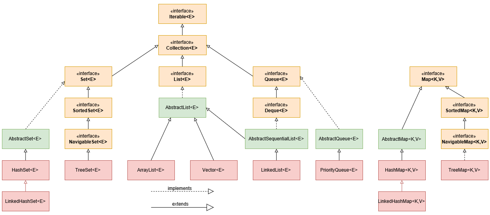

# Глава 18. Пакет java.util: Collections Framework

**Интерфейсы** из пакета java.util:

|                         |                                      |                                   |
| ----------------------  | ------------------------------------ | --------------------------------- |
| Collection              | Map.Entry                            | Set                               |
| Comparator              | NavigableMap                         | SortedMap                         |
| Deque                   | NavigableSet                         | SortedSet                         |
| Enumeration             | Observer                             | Spliterator             (c JDK 8) |
| EventListener           | PrimitiveIterator          (c JDK 8) | Spliterator.OfDouble    (c JDK 8) |
| Formattable             | PrimitiveIterator.OfDouble (c JDK 8) | Spliterator.OfInt       (c JDK 8) |
| Iterator                | PrimitiveIterator.OfInt    (c JDK 8) | Spliterator.OfLong      (c JDK 8) |
| List                    | PrimitiveIterator.OfLong   (c JDK 8) | Spliterator.OfPrimitive (c JDK 8) |
| ListIterator            | Queue                                |                                   |
| Map                     | RandomAccess                         |                                   |

**Классы** из пакета java.util:

|                                   |                                 |                              |
| --------------------------------- | ------------------------------- | ---------------------------- |
| AbstractCollection                | FormattableFlags                | Properties                   |
| AbstractList                      | Formatter                       | PropertyPermissions          |
| AbstractMap                       | GregorianCalendar               | PropertyResourceBundle       |
| AbstractQueue                     | HashMap                         | Random                       |
| AbstractSequentialList            | HashSet                         | ResourceBundle               |
| AbstractSet                       | Hashtable                       | Scanner                      |
| ArrayDeque                        | IdentityHashMap                 | ServiceLoader                |
| ArrayList                         | IntSummaryStatistics  (c JDK 8) | SimpleTimeZone               |
| Arrays                            | LinkedHashMap                   | Spliterators       (c JDK 8) |
| Base64                  (c JDK 8) | LinkedHashSet                   | SplitableRandom    (c JDK 8) |
| BitSet                            | LinkedList                      | Stack                        |
| Calendar                          | ListResourceBundle              | StringJoiner       (c JDK 8) |
| Collections                       | Locale                          | StringTokenizer              |
| Currency                          | LongSummaryStatistics (c JDK 8) | Timer                        |
| Date                              | Objects                         | TimerTask                    |
| Dictionary                        | Observable                      | TimeZone                     |
| DoubleSummaryStatistics (c JDK 8) | Optional              (c JDK 8) | TreeMap                      |
| EnumMap                           | OptionalDouble        (c JDK 8) | TreeSet                      |
| EnumSet                           | OptionalInt           (c JDK 8) | UUID                         |
| EventListenerProxy                | OptionalLong          (c JDK 8) | Vector                       |
| EventObject                       | PriorityQueue                   | WeakHashMap                  |

**Каркас коллекций Collections Framework** - это иерархия интерфейсов и классов для управления группами объектов.

Коллекции появились в J2SE 1.2, до этого использовались классы Dictionary, Vector, Stack и Properties.
Начиная с JDK 5 коллекции стали _обобщёнными_, поддерживают автоматическую упаковку/распаковку примитивных типов,
перебор элементов в цикле for в стиле for each (благодаря реализации интерфейса Iterable).

**Каркас коллекций обеспечил**:
* Высокую производительность из-за эффективной реализации коллекций (дин. массивов, связных списков, деревьев, хеш-таблиц);
* Единообразное функционирование коллекций;
* Возможность расширения/адаптации коллекций за счёт единого набора стандартных интерфейсов;
* Интеграцию с стандартными массивами.

**Составляющие каркаса коллекций**:
* Интерфейсы и классы, реализующие коллекции;
* Алгоритмы, обрабатывающие коллекции - набор статических методов в классе Collections;
* Интерфейс итератора Iterator, обеспечивающий поочерёдный доступ к элементам коллекции (перебор содержимого коллекции);
* Интерфейс итератора-разделителя Spliterator (начиная с JDK 8), обеспечивающий параллельную итерацию элементов коллекции;
* Интерфейсы и классы отображений (map), в которых хранятся пары "ключ-значение". Отображения не являются коллекциями.
  Но из отображения можно получить представление коллекции.

**Иерархия интерфейсов и классов коллекций:**



## Интерфейсы коллекций

| Интерфейс    | Описание                                                                                              |
| ------------ | ----------------------------------------------------------------------------------------------------- |
| Collection   | Обрабатывает группы объектов, вершина иерархии интерфейсов коллекций; расширяет интерфейс Iterable *  |
| List         | Управляет списками объектов, сохраняет последовательность элементов (индекс), допускает повторяющиеся элементы; расширяет Collection |
| Set          | Управляет множествами, содержащими уникальные элементы (не допускает повторяющихся элементов); расширяет Collection |
| SortedSet    | Управляет отсортированными множествами в порядке возрастания; не допускает пустых значений (null); расширяет Set |
| NavigableSet | Извлекает элементы по результатам поиска ближайшего совпадения (есть поиск); расширяет SortedSet |
| Queue        | Организует очередь FIFO (однонаправленную) - список, где элементы удаляются только из начала очереди; не допускает пустых элементов (null); расширяет Collection |
| Deque        | Организует двустороннюю очередь (двунаправленную) - может работать как стандартная очередь FIFO, так и как стек LIFO; не допускает пустых элементов; расширяет Queue |

`*` Интерфейс Iterable позволяет перебирать элементы коллекций в цикле в стиле for each.

**Методы интерфейсов коллекций**:
* Collection: add, addAll, clear, contains, containsAll, equals, hashCode, isEmpty, iterator, parallelStream,
  remove, removeAll, removeIf, retainAll, size, spliterator, stream, toArray;
* List: add, addAll, get, indexOf, lastIndexOf, listIterator, remove, replaceAll, set, sort, subList;
* Set: нет (только унаследованные от Collection);
* SortedSet: comparator, first, headSet, last, subSet, tailSet;
* NavigableSet: ceiling, descendingIterator, descendingSet, floor, headSet, higher, lower, pollFirst, pollLast,
  subSet, tailSet;
* Queue: element, offer, peek, poll, remove;
* Deque: addFirst, addLast, descendingIterator, getFirst, getLast, offerFirst, offerLast, peekFirst, peekLast,
  pollFirst, pollLast, pop, push, removeFirst, removeFirstOccurrence, removeLast, removeLastOccurrence.

## Классы коллекций

| Класс                  | Описание                                                                                    |
| ---------------------- | ------------------------------------------------------------------------------------------- |
| AbstractCollection     | Реализует большую часть интерфейса Collection                                               |
| AbstractList           | Реализует большую часть интерфейса List, расширяет класс AbstractCollection                 |
| AbstractSequentialList | Реализует коллекции с последовательным, а не случайным доступом к элементам, расширяет класс AbstractList |
| LinkedList             | Реализует двусвязный список, расширяет класс AbstractSequentialList и реализует интерфейсы List, Deque, допускает любые элементы (включая null) |
| ArrayList              | Реализует динамический массив (не фиксированной длины, ёмкость наращивается и сокращается автоматически, но можно и "вручную" методом ensureCapacity), расширяет класс AbstractList |
| AbstractSet            | Реализует большую часть интерфейса Set, расширяет класс AbstractCollection                  |
| EnumSet                | Расширяет класс AbstractSet для применения вместе с элементами типа enum                    |
| HashSet                | Расширяет класс AbstractSet для применения вместе с хеш-таблицами                           |
| LinkedHashSet          | Расширяет класс HashSet, разрешая итерацию с вводом элементов в определённом порядке        |
| TreeSet                | Реализует множество, хранимое в древовидной структуре, расширяет класс AbstractSet          |
| AbstractQueue          | Реализует отдельные части интерфейса Queue, расширяет класс AbstractCollection              |
| PriorityQueue          | Расширяет класс AbstractQueue для поддержки очереди по приоритетам на основе компаратора очереди |
| ArrayDeque             | Реализует динамическую двустороннюю очередь, расширяет класс AbstractCollection и реализует интерфейс Deque |

**Классы коллекций не синхронизированы (не потокобезопасны) для ускорения их работы**.
Но если требуется, то можно получить их синхронизированные (потокобезопасные) варианты с помощью алгоритмов коллекций
(статических методов класса Collections, начинающихся на synchronized), например:
```
List list = Collections.synchronizedList(new ArrayList(...));
```

## Интерфейсы итераторов и др.

| Интерфейс    | Описание                                                                                              |
| ------------ | ----------------------------------------------------------------------------------------------------- |
| Iterator     | Управляет последовательным перебором элементов коллекции, позволяет добавлять и удалять элементы      |
| ListIterator | Предоставляет двусторонний обход списка, позволяет изменять элементы, расширяет Iterator              |
| Spliterator  | Итератор-разделитель (начиная с JDK 8) позволяет перебирать последовательность элементов, поддерживает параллельную итерацию отдельных частей последовательности элементов |
| Comparator   | Определяет сравниваемые объекты, нужен для упорядочения (сортировки) элементов в коллекциях           |
| RandomAccess | Коллекция, реализующая этот интерфейс, поддерживает эффективный произвольный доступ к своим элементам * |

`*` Интерфейс RandomAccess реализуют классы ArrayList, Vector.
Чтобы определить реализует ли класс (объект) интерфейс, можно использовать оператор instanceof.


**Методы интерфейсов итераторов**:
* Iterator: forEachRemaining (с JDK 8), hasNext, next, remove;
* ListIterator: forEachRemaining (с JDK 8), add, hasNext, hasPrevious, next, nextIndex, previous, previousIndex, remove, set;
* Spliterator: characteristics, estimateSize, forEachRemaining, getComparator, getExactSizeIfKnown, hasCharacteristics,
  tryAdvance, trySplit.

## Отображение

Отображение (map) - это объект, сохраняющий связи между объектами ключей и значений в виде пар "ключ-значение".
По заданному ключу можно найти значение. Ключи уникальны, а значения могут повторяться.

Отображение не является коллекцией и не поддерживает интерфейс Iterable, содержимое нельзя перебрать в цикле for each.
Но из отображения можно получить представление коллекции, которое потом можно перебрать в цикле или итератором.

## Интерфейсы отображений

| Интерфейс    | Описание                                                                                              |
| ------------ | ----------------------------------------------------------------------------------------------------- |
| Map          | Хранит записи (пары "ключ-значение") - отображает уникальные ключи на значения                        |
| Map.Entry    | Описывает пару "ключ-значение"; это внутренний интерфейс интерфейса Map                               |
| SortedMap    | Хранит записи в порядке увеличения значения ключа (т.е. отсортированные); расширяет интерфейс Map     |
| NavigableMap | Позволяет искать элементы отображения по наиболее точному совпадению; расширяет интерфейс SortedMap   |

**Методы интерфейсов отображений**:
* Map: clear, containsKey, containsValue, entrySet, equals, get, hashCode, isEmpty, keySet, put, putAll, remove(k),
  size, values; добавленные в JDK 8: compute, computeIfAbsent, computeIfPresent, forEach, getOrDefault, merge,
  putIfAbsent, remove(k,v), replace, replaceAll;
* Map.Entry: equals, getKey, getValue, hashCode, setValue;
  добавленные в JDK 8 статические методы, возвращающие компаратор по ключу и значению: comparingByKey, comparingByValue;
* SortedMap: comparator, firstKey, lastKey, headMap, subMap, tailMap;
* NavigableMap: ceilingEntry, ceilingKey, descendingKeySet, descendingMap, firstEntry, floorEntry, floorKey, headMap,
  higherEntry, higherKey, lastEntry, lowerEntry, lowerKey, navigableKeySet, pollFirstEntry, pollLastEntry, subMap, tailMap.

## Классы отображений

| Класс           | Описание                                                                                           |
| --------------- | -------------------------------------------------------------------------------------------------- |
| AbstractMap     | Реализует большую часть интерфейса Map                                                             |
| EnumMap         | Расширяет класс AbstractMap для применения с ключами типа enum                                     |
| HashMap         | Расширяет класс AbstractMap; отображение хранится в виде хеш-таблицы, это обеспечивает постоянное время выполнения методов put и get; порядок следования элементов (пар "ключ-значение") не сохраняется |
| TreeMap         | Расширяет класс AbstractMap, реализует интерфейс NavigableMap; отображение хранится в виде древовидной структуры; пары "ключ-значение" отсортированы по возрастанию ключа или заданным компаратором, это обеспечивает их быстрое извлечение |
| WeakHashMap     | Расширяет класс AbstractMap; отображение хранится в виде хеш-таблицы со слабыми ключами: сохраняются пары "слабая ссылка на ключ - значение"; особенность слабых ссылок (weak reference) состоит в том, что они игнорируются сборщиком мусора, т.е. если на объект-ключ нет других ссылок, он уничтожается; перед любым обращением к WeakHashMap (get, put, size) анализируются невалидные ссылки и соответствующая пара удаляется |
| LinkedHashMap   | Расширяет класс HashMap; элементы хранятся и возвращаются при итерации представления отображения в том же порядке, в котором они вводились в отображение; в конструкторе можно указать порядок расположения элементов в связном списке: в порядке ввода или последнего доступа |
| IdentityHashMap | Расширяет класс AbstractMap, реализует интерфейс Map; аналогичен классу HashMap, но при сравнении элементов отображения выполняется проверка ссылок на равенство |

## Интерфейс Comparator

Интерфейс Comparator определяет сравниваемые объекты, управляет порядком сохранения элементов в отсортированных коллекциях.
Т.е. он нужен для упорядочения (сортировки) элементов в коллекциях.
По умолчанию реализовано _естественное упорядочение_ - A, B, C,... и 1, 2, 3, ...
Но порядок упорядочения объектов можно изменить с помощью реализации метода compare() (переопределения его
в своем классе компаратора или лямбда-выражении).

**Методы интерфейса Comparator**:
* int compare(T obj1, T obj2) (результат равен 0 если объекты равны, положительный если obj1 > obj2, иначе отрицательный);
  boolean equals(object obj);
* добавленные в JDK 8 методы по умолчанию и статические методы: reversed, reverseOrder, naturalOrder,
  nullsFirst, nullsLast, thenComparing, thenComparingDouble, thenComparingInt, thenComparingLong,
  comparing, comparingDouble, comparingInt, comparingLong.

## Алгоритмы коллекций

**Алгоритмы коллекций** представляют собой **статические обобщённые методы** из класса java.util.Collections.
Их можно применять к коллекциям и отображениям. Все методы - обобщённые (начиная с JDK 5).

**Методы**, определённые в классе Collections:

addAll, asLifoQueue, binarySearch;

checkedCollection, checkedList, checkedMap, checkedNavigableMap, checkedNavigableSet, checkedQueue, checkedSet,
checkedSortedMap, checkedSortedSet;

copy, disjoint;

emptyEnumeration, emptyIterator, emptyList, emptyListIterator, emptyMap, emptyNavigableMap, emptyNavigableSet, emptySet,
emptySortedMap, emptySortedSet;

enumeration, fill, frequency, indexOfSubList, lastIndexOfSubList, list, max, min, nCopies, newSetFromMap, replaceAll,
reverse, reverseOrder, rotate, shuffle, singleton, singletonList, singletonMap, sort, swap;

synchronizedCollection, synchronizedList, synchronizedMap, synchronizedNavigableMap, synchronizedNavigableSet,
synchronizedSet, synchronizedSortedMap, synchronizedSortedSet;

unmodifiableCollection, unmodifiableList, unmodifiableMap, unmodifiableNavigableMap, unmodifiableNavigableSet,
unmodifiableSet, unmodifiableSortedMap, unmodifiableSortedSet.

* Методы, начинающиеся на "checked" - "проверяемые", возвращают динамически типизированное представление коллекции.
  Коллекция контролирует вводимые в коллекцию объекты на предмет совместимости типов.
  Попытка вставить элемент неправильного типа приведёт к исключению ClassCastException.

* Методы, начинающиеся на "synchronized" возвращают синхронизированные (потокобезопасные) копии коллекций.
  Итераторы синхронизированных коллекций должны использоваться в пределах блоков кода с модификатором доступа synchronized.

* Методы, начинающиеся на "unmodifiable" возвращают неизменяемые коллекции. Это бывает нужно, чтобы гарантировать доступ
  к коллекции только для чтения, без права записи. Попытка изменить коллекцию напрямую или через её итератор приведёт 
  к исключению UnsupportedOperationException.

* В классе Collections также определены три статические переменные:
  public static final EMPTY_LIST, EMPTY_SET, EMPTY_MAP. Они возвращают пустой список, набор и отображение соответственно.
  Они неизменяемые (immutable) и сериализуемые (serializable).

## Массивы

**Методы** для работы с массивами, определённые в классе java.util.Arrays:

* asList, binarySearch, copyOf, copyOfRange, equals, deepEquals, fill, sort, toString, hashCode, deepToString, deepHashCode;
* начиная с JDK 8: parallelSort, spliterator, stream, setAll, parallelSetAll, parallelPrefix.

## Устаревшие (унаследованные) классы

В первых версиях Java отсутствовали коллекции. Вместо них были определены интерфейсы и классы для хранения данных.
Начиная с J2SE 1.2 были внедрены коллекции и часть устаревших (унаследованных) классов была переделана для поддержки
коллекций. Начиная с JDK 5 устаревшие интерфейсы и классы сделаны обобщёнными.
Теперь они являются частью каркаса коллекций (Collections Framework).

**Все устаревшие классы синхронизированы (потокобезопасны)** в отличие от современных классов коллекций.

Интерфейс и классы, определённые в пакете java.util:
интерфейс Enumeration; классы Vector, Stack, Dictionary, Hashtable, Properties.

* **Интерфейс Enumeration** содержит методы для поочерёдного перебора элементов коллекции:
  boolean hasMoreElements, E nextElement. Заменён современным интерфейсом Iterator.

* **Класс Vector** реализует динамический массив (подобен современному классу ArrayList). Расширяет класс AbstractList,
  реализует интерфейсы List, Iterator, допускает перебор элементов в цикле for each.
  Методы класса Vector (помимо определённых в интерфейсе List):
  addElement, capacity, clone, contains, copyInto, elementAt, elements, ensureCapacity, firstElement, indexOf,
  insertElementAt, isEmpty, lastElement, lastIndexOf, removeAllElements, removeElement, removeElementAt, setElementAt,
  setSize, size, toString, trimToSize.

* **Класс Stack** реализует стандартный стек (LIFO), расширяет класс Vector. 
  Методы класса Stack (помимо определённых в классе Vector): empty, peek, pop, push, search.
  Хотя класс Stack пока рекомендуется для использования, но лучше выбирать современный класс ArrayDeque.

* **Класс Dictionary** (абстрактный) хранит список пар "ключ-значение" (аналогично современному интерфейсу отображения Map).
  Хотя класс Dictionary пока рекомендуется для использования, но лучше выбирать современные классы, реализующие Map.
  Методы класса Dictionary: put, get, elements, keys, isEmpty, size.

* **Класс Hashtable** реализует класс Dictionary и интерфейс Map (подобен современному классу HashMap).
  Хранит пары "ключ-значение" в хеш-таблице. Но ни ключ, ни значение не могут быть пустыми (null).
  Методы класса Hashtable (помимо определённых в интерфейсе Map):
  clear, clone, contains, containsKey, containsValue, elements, get, isEmpty, keys, put, rehash, remove, size, toString.

* **Класс Properties** (не обобщённый) хранит список пар "ключ-значение" типа String. Наследуется от класса Hashtable.
  Класс Properties используется в ряде других классов, например, System.getProperties() (получение переменных окружения).
  Методы класса Properties (помимо определённых в классе Hashtable):
  getProperty, list, load, loadFromXML, setProperty, store, storeToXML, stringPropertyNames;
  save - не рекомендован для использования, заменён методом store.
